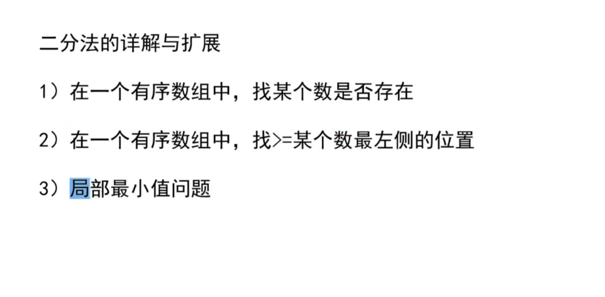
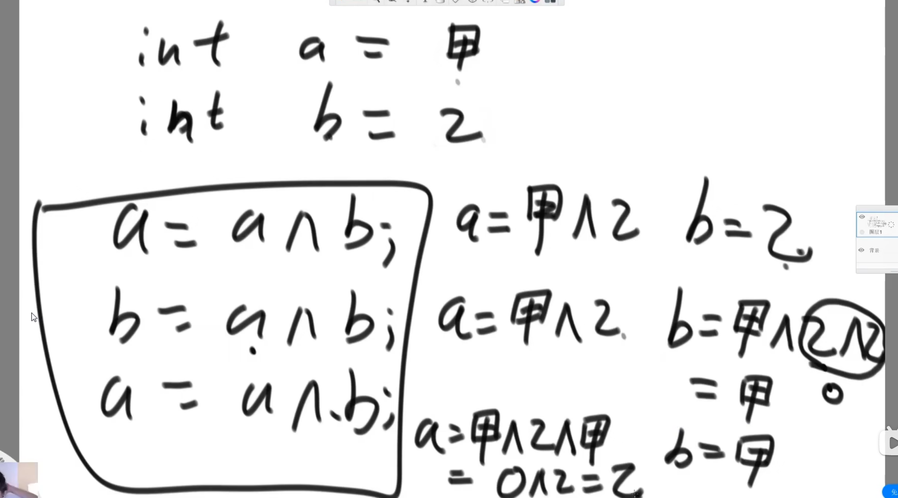

# 算法与数据结构

***常数操作***

1.与数据量无关的操作叫做常数操作

  例如:c语言数组的寻址 加减乘除 
  非常数操作 链表寻址.
2.选择排序中的时间复杂度o(n^2).

+ 计算方式
+ 取最高次幂 忽略系数

+ 插入排序

  二分法

+ 小拓展 只要能够确定丢掉一边就能够二分
不需要有序

+ 如(3) 有局部最小的趋势

##  异或 
+ (无进位相加)
+ 交换的异或算法 (前提a,b内存独立)

结果,只与在该二进制位上0,1出现的次数有关
满足交换,结合,且与顺序无关 

+ eg.
+ 1.一个数组 其中有一个数出现了奇数次,剩余出现了偶数次,找出这个数
+ 答案: 设一个变量eor,和arr中所有数异或,结果就是这个数
  
+ 2.一个数组 其中有两个数出现了奇数次,剩余出现了偶数次,找出这两个数
+ 答案

