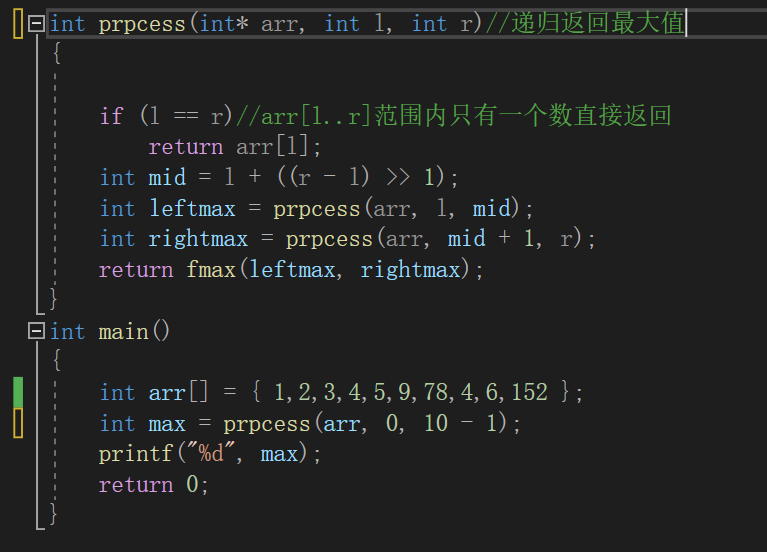

## O(nlogn)排序

# master公式

+ 适用条件: 当递归满足子问题等规模
+ O(n) 带入a,b,c计算

+ a指代的是process执行两次
+ b指代的是n数据被分成两半
+ d指代的是除去递归过程剩余的算法的时间复杂度

# 归并排序

* 这就是O(Nlogn)排序
用到了分治的思想

# 两道题目
## 荷兰国旗问题(开三个区域)
-----

+ 荷兰国旗升级版,左下于,中等于,右大于

+ 快速排序3.0版本
+ 
 