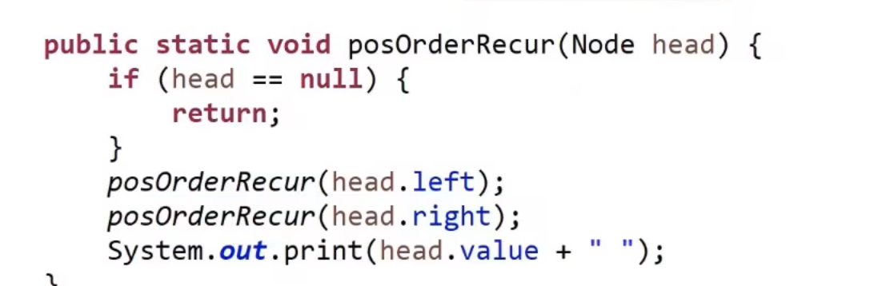
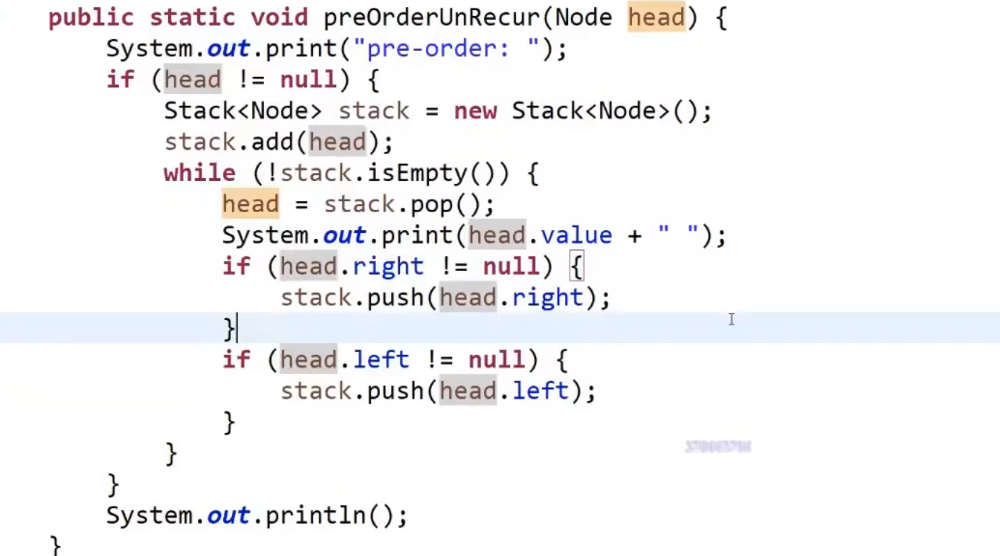
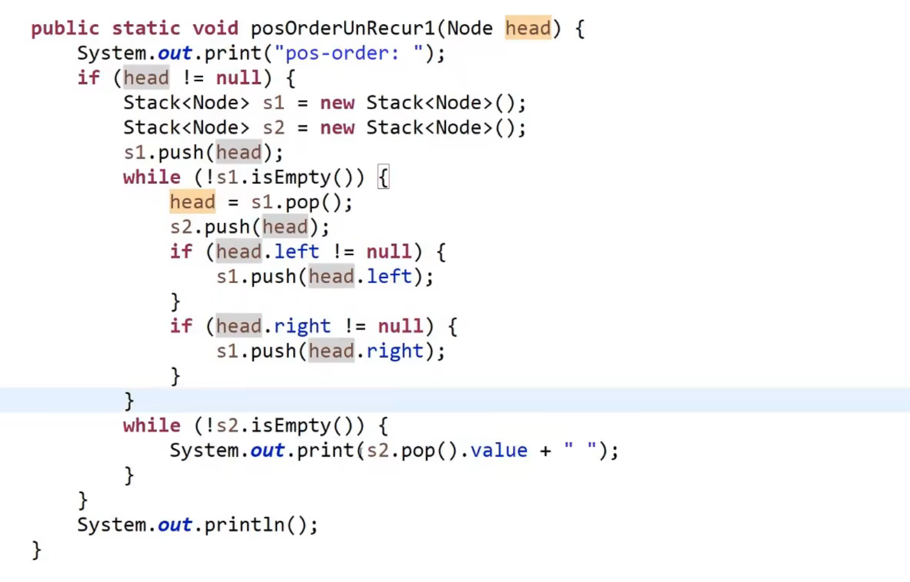
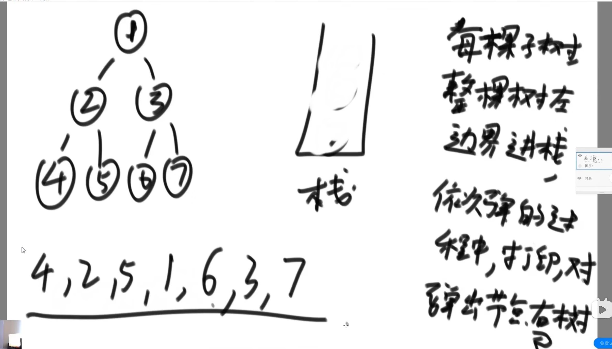
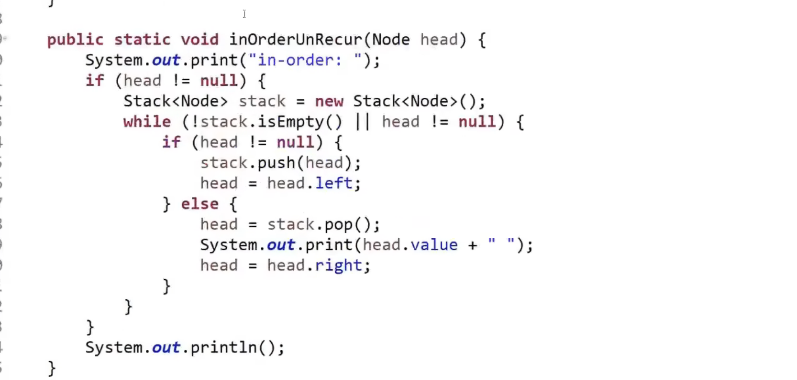
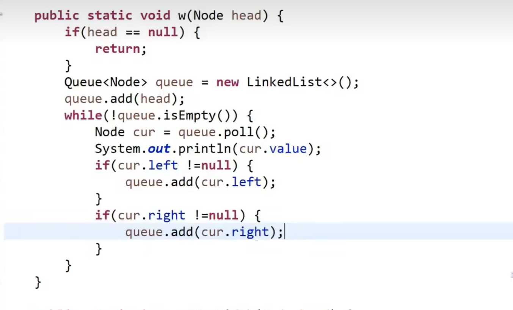

# 二叉树

上面这个是递归序,分为先序遍历,中序遍历,后序遍历,分别为数字第一次,第二次,第三次在递归序中出现的位置

+ 代码 先序
+ 
+ 中序
+ 
+ 后序
+ 

+非递归行为,调用栈的时候要先压右节点,再压左节点,先进后出

+ 这个是中序遍历的打印方法

+ 代码在这
+ 

+ 宽度优先遍历,是指从一行的左边遍历到右边
+ 
+ 深度优先遍历,是指从一课数的头从左遍历到叶节点的位置
